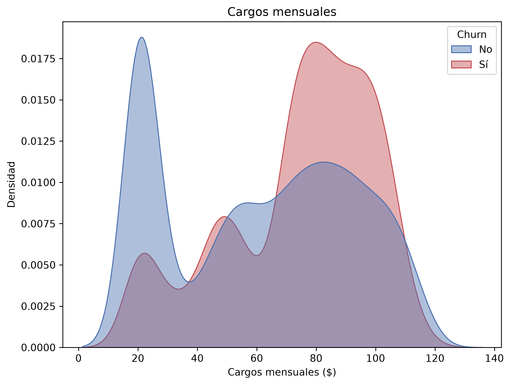

# Informe Técnico

# **Problema de negocio**
Para las empresas de telecomunicaciones, la retención de clientes es un desafío empresarial crítico. En un mercado donde los usuarios dependen de la conectividad diaria y pueden migrar fácilmente hacia la competencia ante la más mínima interrupción o mala experiencia, la tasa de abandono (churn) representa uno de los mayores riesgos financieros del sector. Considerando que adquirir un nuevo usuario cuesta hasta cinco veces más que retener a uno actual, no controlar el churn se traduce en una pérdida directa de ingresos que amenaza la rentabilidad de la compañía.

Para hacer frente a este problema, el principal desafío analítico debe ser comprender los factores que impulsan las cancelaciones y, sobre todo, predecir qué clientes específicos están en riesgo de abandonar el servicio. Mediante el análisis profundo de los datos y la implementación de modelos predictivos de churn, las empresas de telecomunicaciones pueden anticiparse a las bajas, diseñar estrategias de retención segmentadas y mejorar proactivamente la experiencia del usuario, convirtiendo la fidelización en un motor de crecimiento sostenible.

# Objetivos del proyecto
### Objetivo general del proyecto:
- Desarrollar un modelo de Machine Learning capaz de predecir la probabilidad de que un cliente abandone la empresa, permitiendo al equipo de marketing y retención intervenir de manera proactiva.

### Objetivos específicos de esta primera fase de exploración:
- Auditar y limpiar la calidad de los datos.
- Construir el perfil demográfico y de consumo de los clientes que ya hicieron churn frente a los que se mantienen.
- Determinar qué factores tienen mayor correlación estadística con el abandono.
- Preparar el dataset y dejarlo listo para la fase de modelado algorítmico.

# KPIs que resolverán el problema de negocio
Dado que aún no se implementará el modelo predictivo, el éxito de esta primera fase se medirá por la calidad de la información extraída y la calidad del dataset:

- Lograr un data set con 0% de valores nulos ni inconsistencias tras el proceso de limpieza.
- Cuantificar la proporción exacta de la clase objetivo para determinar qué técnica de balanceo se requerirá en la siguiente fase.
- Generar un reportes con al menos 5 variables de alto impacto en churn que estén visualmente demostradas.

# Descripción General y Calidad del Conjunto de Datos
El conjunto de datos contiene información sobre los clientes de una empresa de telecomunicaciones y si se dieron de baja (cancelaron su servicio) o no. Cada fila representa a un cliente, cada columna contiene los atributos del cliente descritos. El conjunto de datos original está compuesto por 7043 registros y 21 características.

El conjunto de datos incluye información sobre:

* Clientes que se dieron de baja en el último mes – la columna se llama Churn (tasa de abandono).
* Servicios a los que cada cliente se ha suscrito – teléfono, múltiples líneas, internet, seguridad en línea, respaldo en línea, protección de dispositivos, soporte técnico y streaming de TV y películas.
* Información de la cuenta del cliente – cuánto tiempo llevan como clientes, contrato, método de pago, facturación electrónica, cargos mensuales y cargos totales.
* Información demográfica sobre los clientes – género, rango de edad, y si tienen pareja y dependientes.

Calidad de Datos:

* Variables Categóricas: Alta presencia de datos cualitativos estructurados como texto (ej.
género, tipo de contrato, métodos de pago).
* Duplicidad: No se han detectado registros duplicados en el conjunto de datos.
* Completitud: La integridad de los datos es excelente. El único hallazgo de valores nulos se
presentó en la variable TotalCharges (11 registros faltantes), los cuales corresponden
estrictamente a clientes con una antigüedad (tenure) de 0 meses.
* Análisis de Valores Atípicos (Outliers): Se evaluaron las variables numéricas continuas
mediante el método de Rango Intercuartil (IQR). Los resultados indicaron una ausencia
total de valores atípicos en las características tenure, MonthlyCharges y
TotalCharges.

# Análisis exploratorio de los datos (EDA).

# Preparación para modelado

# Evaluación de sesgos, aspectos éticos y estándares de privacidad

Impacto de los errores de predicción: Los Falsos Negativos (FN) resultan en la pérdida inevitable de clientes, mientras que los Falsos Positivos (FP) provocan gastos ineficientes en estrategias de retención y marketing.

Sesgo por desbalance de datos: El modelo está desbalanceado. Para hacerlo equitativo con la clase minoritaria (Churn), se requiere aplicar técnicas de re-muestreo exclusivamente sobre el conjunto de entrenamiento.

Solución propuesta (SMOTE): Se recomienda implementar SMOTE para generar datos sintéticos de la clase minoritaria basándose en vecinos cercanos. Esto evita la duplicidad exacta de datos y ayuda al algoritmo a definir mejores fronteras de decisión.

Aspectos eticos y de privacidad:

Exigencias normativas y sanciones regulatorias: Las legislaciones actuales de privacidad (GDPR y Ley 21.719) exigen el consentimiento explícito, protegen el uso de datos sensibles y regulan las decisiones algorítmicas (otorgando derecho a explicación humana). Su incumplimiento conlleva multas severas de hasta el 4% de la facturación anual.

Vulnerabilidad del conjunto de datos: Actualmente, el dataset infringe la normativa al carecer de protección sobre la Información de Identificación Personal (PII), exponiendo directamente el identificador del cliente (CustomerID) junto a su comportamiento financiero y personal.

Medidas de protección y mitigación propuestas: Para cumplir con la ley y garantizar la privacidad, se aplicarán las siguientes estrategias:

Seudonimización (Hashing): Transformar identificadores directos en códigos irreversibles.

Minimización de datos: Utilizar estrictamente las variables necesarias para el modelo, descartando información sensible o redundante.

Gobernanza y seguridad: Implementar Control de Acceso Basado en Roles (RBAC) para restringir el manejo de los datos solo al personal autorizado.

Transparencia: Habilitar canales formales para que los usuarios puedan ejercer sus derechos ARCO+ (Acceso, Rectificación, Cancelación, Oposición y Portabilidad).

# Metodología utilizada (CRISP-DM).
